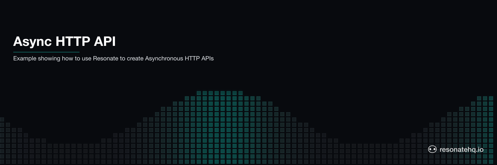

<p align="center">
  <picture>
    <source media="(prefers-color-scheme: dark)" srcset="./assets/banner-dark.png">
    <source media="(prefers-color-scheme: light)" srcset="./assets/banner-light.png">
    
  </picture>
</p>

# Async HTTP API

**Resonate TypeScript SDK**

A simple Express + Resonate project demonstrating durable, fault-tolerant request processing. This example shows how to build an async HTTP API where requests start a durable workflow that survives process restarts and can be polled for completion.

## Use case

This example demonstrates the async request/response pattern with durable execution — perfect for any API that accepts long-running work and must complete reliably even if the server restarts mid-flight.

The gateway accepts a request, starts a durable execution on a registered worker, and immediately returns a request id. The client polls a status endpoint until the work is complete.

## Indefinite execution + recovery

The HTTP gateway and the worker are separate processes. The gateway uses `beginRpc` to start a durable execution without waiting for it to finish:

```typescript
const handle = await resonate.beginRpc(
  id,
  "foo",
  data,
  resonate.options({ target: "poll://any@worker" }),
);
```

The worker registers the durable function and processes work as it arrives:

```typescript
function* foo(_: Context, data: unknown) {
  // ... do the work ...
  return { result: `Processed: ${JSON.stringify(data)}`, timestamp: Date.now() };
}

resonate.register("foo", foo);
```

If the worker crashes mid-execution, Resonate re-dispatches the work to another available worker in the `worker` group. The execution resumes from the last durable checkpoint.

## Deduplication

Each durable execution pairs with a promise that has a unique id. Resonate deduplicates by id — calling `/begin` twice with the same `id` reconnects to the in-flight (or already-completed) execution rather than starting duplicate work.

```typescript
// Same id => same workflow. Resonate hands back the existing handle.
await resonate.beginRpc(id, "foo", data, /* ... */);
```

This is what makes durable async APIs safe to retry from the client side.

## Non-blocking status polling

The `/wait` endpoint uses `resonate.get(id)` and `handle.done()` to check execution state without blocking the gateway thread. Clients poll until status becomes `resolved` or `rejected`.

```typescript
const handle = await resonate.get(id);
if (await handle.done()) {
  const result = await handle.result();
  // respond resolved
} else {
  // respond pending
}
```

## How to run the example

This example uses [bun](https://bun.sh/) as the TypeScript runtime and package manager.

After cloning this repo, install dependencies:

```shell
bun install
```

This example requires a Resonate Server running locally:

```shell
brew install resonatehq/tap/resonate
resonate dev
```

You will need three terminals to run the example: one for the gateway, one for the worker, and one to send requests.

In _Terminal 1_, start the gateway:

```shell
bun run gateway.ts
```

In _Terminal 2_, start the worker:

```shell
bun run worker.ts
```

In _Terminal 3_, send a request:

```shell
# Start a durable execution. Pass an id for deduplication.
curl -X POST "http://127.0.0.1:5001/begin?id=task-001" \
  -H "Content-Type: application/json" \
  -d '{"hello": "world"}'

# Poll for the result.
curl "http://127.0.0.1:5001/wait?id=task-001"
```

## API endpoints

### `POST /begin`

Starts a new durable execution.

**Query parameters**

- `id` (optional) — custom id for deduplication. A UUID is generated if omitted.

**Body** (optional, JSON) — the data to pass to the worker. Defaults to `{ "foo": "bar" }`.

**Response**

```json
{
  "promise": "task-001",
  "status": "pending",
  "wait": "/wait?id=task-001"
}
```

### `GET /wait`

Polls the status of a durable execution.

**Query parameters**

- `id` (required) — the promise id returned from `/begin`.

**Response — pending**

```json
{
  "status": "pending",
  "promise_id": "task-001",
  "message": "Processing in progress"
}
```

**Response — resolved**

```json
{
  "status": "resolved",
  "promise_id": "task-001",
  "result": { "result": "Processed: {\"hello\":\"world\"}", "timestamp": 1714000000000 }
}
```

## Learn more

- [Resonate Documentation](https://docs.resonatehq.io)
- [Async HTTP API Pattern](https://docs.resonatehq.io/get-started/examples/async-http-api)
- [TypeScript SDK Guide](https://docs.resonatehq.io/develop/typescript)
